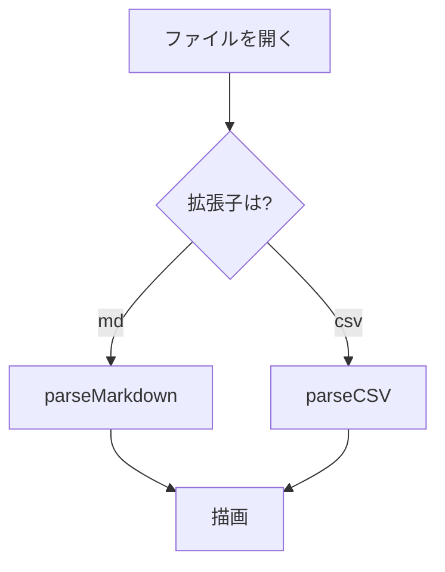

# 見出し 1

インライン記法: **太字**、*イタリック*、***太字イタリック***、~~取り消し線~~、`インラインコード`

アンダースコア記法: __太字__、_イタリック_、___太字イタリック___

単語内アンダースコア: snake_case_a snake_case_b

カギ括弧で囲んだインラインコード: 「`コード`」

同一行に複数のインラインコード: `A` / `B` / `C`

二重バッククォート: `` `バッククォート` を含むコード ``

リンク: [ラベル](https://example.com)、自動リンク: <https://example.com/auto>

画像: 

HTML エスケープ: `<script>alert("x")</script>` & `a > b`

行末2スペースによる強制改行  
2行目

行末バックスラッシュによる強制改行\
2行目

## 見出し 2

### 見出し 3

#### 見出し 4

##### 見出し 5

###### 見出し 6

### 末尾に # を付けた見出し ###

## 水平線

---

***

___

## 引用

> 引用の1行目
> **太字**を含む2行目
>
> - 引用内の箇条書き
> - 2つ目
>
> ```js
> const inQuote = true;
> ```

## リスト

- 箇条書き 1
- 箇条書き 2
  - ネスト 2-1
    - ネスト 2-1-1
- 箇条書き 3

1. 番号付き 1
2. 番号付き 2
   1. ネスト 2-1
   2. ネスト 2-2
3. 番号付き 3

- 項目の1行目
  インデントした継続行
  さらに継続行

### リスト内のコードブロック

- 手順 1
  ```sh
  npm ci
  ```
- 手順 2

### タスクリスト

- [ ] 未チェック
- [x] チェック済み
  - [ ] ネストした未チェック
- [ ] `コード`と**太字**を含む項目

## テーブル

| 左寄せ | 中央寄せ | 右寄せ | 指定なし |
|:-------|:--------:|-------:|----------|
| a | b | 1,234 | あいうえお |
| **太字** | `コード` | 42 | [リンク](https://example.com) |
| セルが3つの行 | 2 | 3 |
| セルが5つの行 | 2 | 3 | 4 | 5 |

## コードブロック

```js
function greet(name) {
  return `Hello, ${name}!`;
}
```

```
プレーンテキスト
  インデントも保持される
```

```html
<div class="a" data-x="1">&amp; < ></div>
```

## Mermaid


